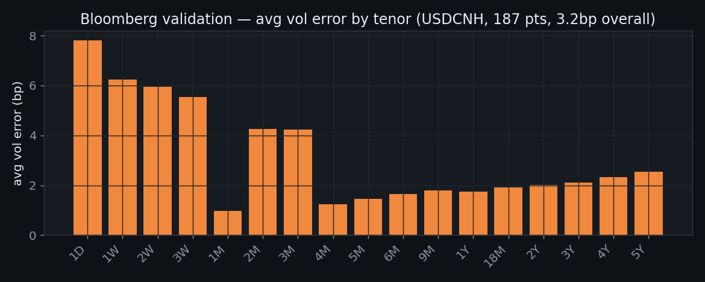
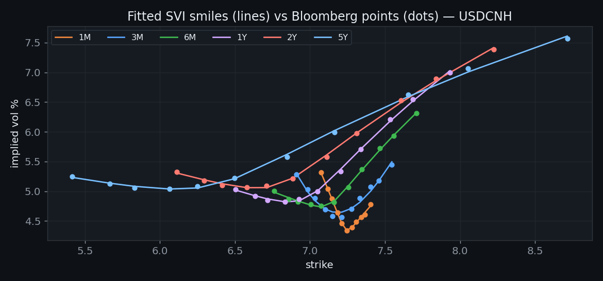
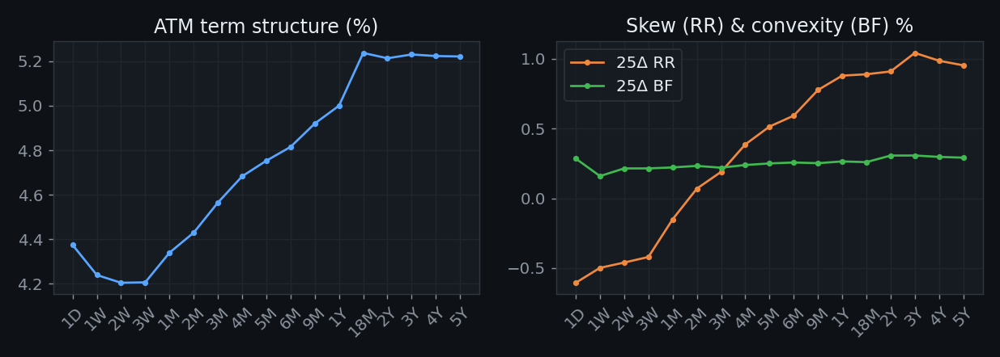
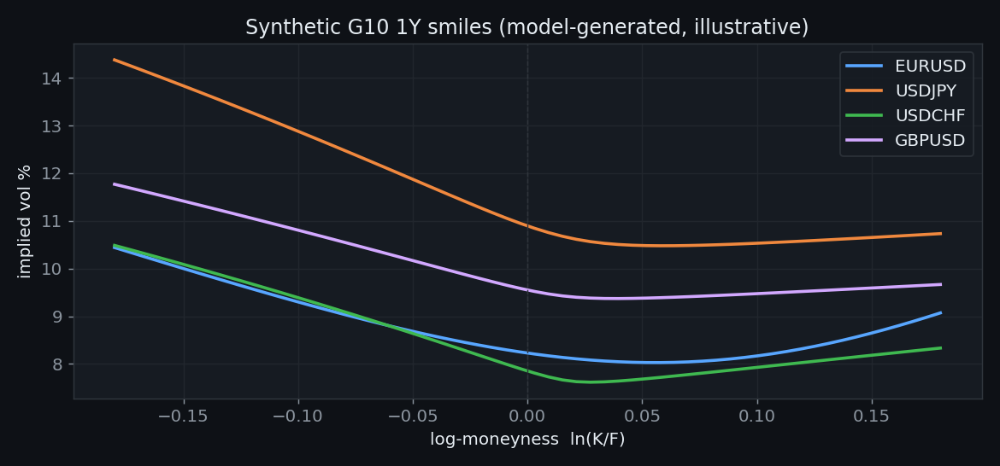
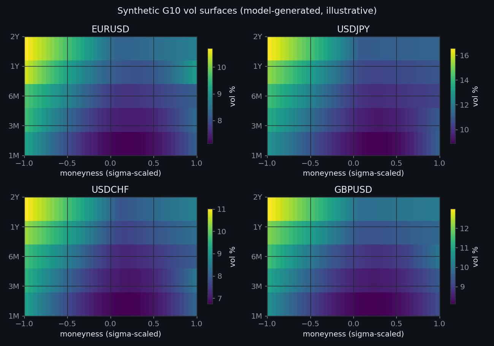
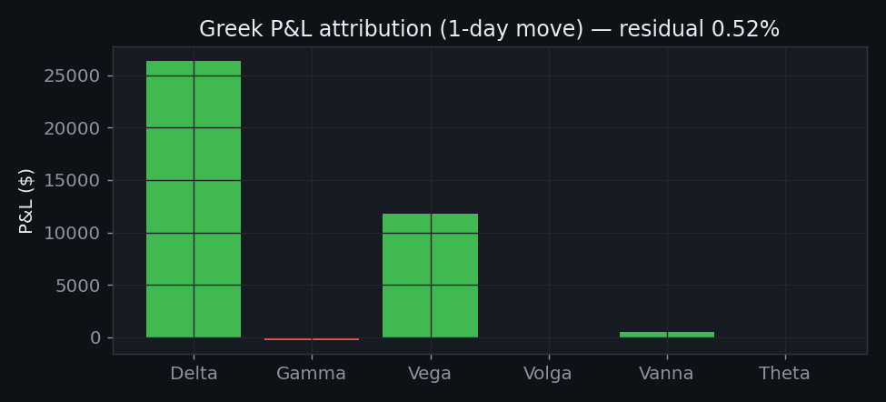
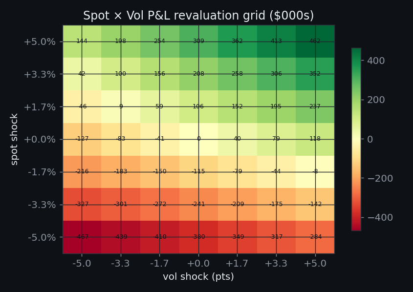

# fxvol — FX Volatility Modelling Stack

A Python library implementing the full FX options modelling ladder **from volatility-surface construction to multi-factor exotic
models**, validated against Bloomberg vol surface, with a Greek P&L attribution engine and
a risk grid and limit monitor built on top.

**Highlight:** reproduces Bloomberg's USDCNH OVML vol surface to **3.2 bp
average error across 187 points** under full market conventions (premium-adjusted
delta-neutral straddle, tenor-dependent spot/forward delta).


## Bloomberg validation

Each tenor's SVI smile is calibrated to all 11 Bloomberg strike/vol points under
Bloomberg's own conventions (delta-neutral straddle ATM, premium-adjusted,
spot delta <1Y / forward delta >=1Y) using Bloomberg's actual forwards. The
surface is then evaluated at Bloomberg's strikes and the implied vol compared.
USDCNH on 05 Mar 2025.



| Metric | Within 10D | Total (187 pts) |
|---|---|---|
| Vol abs error (avg) | 3.19 bp | 3.16 bp |
| Vol abs error (max) | 15.8 bp | 15.8 bp |
| Strike abs error (avg) | 0.00051 | 0.00062 |

Largest diffs sit at 1-day (no 1D forward on the rate screen; noisiest smile).
From 1W out, agreement is under 11 bp including the wings.

### Fitted smiles vs Bloomberg



Dots are Bloomberg's calibrated points; lines are the SVI fit. The smile steepens
and widens with tenor — the SVI parametrization tracks it across the full strike
range.



USDCNH ATM rises 4.4% -> 5.2%; the 25D risk reversal flips from negative (puts
bid) at the front to strongly positive at the back — a real feature of the pair.


## Synthetic G10 surfaces

Because the Bloomberg data is licensed and not redistributed (see note below),
the repo ships **model-generated, illustrative** surfaces for the major pairs so
it runs end-to-end for anyone who clones it. These are built from realistic
ATM / RR / BF term structures — not market quotes — calibrated to resemble each
pair's characteristic smile (USDJPY's steep downside skew, EURUSD's mild low-vol
smile, etc.).





All four surfaces are arbitrage-free (butterfly and calendar checks pass). Build
one with `fxvol.synthetic.g10.build_surface("EURUSD")`.


## The modelling ladder

| Layer | Module | Role |
|---|---|---|
| Foundation | `core/` | Garman-Kohlhagen, full Greeks, FX delta conventions |
| Surface | `surface/` | SVI smile + 2D surface, butterfly & calendar no-arb |
| Local vol | `localvol/` | Dupire local volatility from the surface |
| Stochastic vol | `stochvol/` | Heston via characteristic function + calibration |
| LSV | `lsv/` | Leverage function bridging Heston to exact fit |
| Multi-factor | `multifactor/` | FX spot + dual Hull-White rates, Monte Carlo |

Each layer exists because the one below it fails at something a trader pays for:
Black-Scholes can't see the smile; the surface maps it but says nothing about
dynamics; local vol reprices vanillas exactly but gets the smile's *motion*
wrong (mishedging barriers); Heston fixes dynamics but loses exact fit; LSV
unifies both; and the three-factor model un-freezes interest rates for
long-dated exotics, where FX-rates correlation becomes priced, hedgeable risk.


## Greek P&L explain engine

The nightly desk process: decompose one day's book P&L into
delta / gamma / vega / volga / vanna / theta + an unexplained residual. A
small residual means the risk numbers faithfully describe the book. (Demo book
of four EURUSD options over a +0.4% spot, +0.5pt vol move.)



Delta and vega dominate; gamma, vanna and volga are small but non-zero — and
omitting the cross-terms is exactly what blows the residual open on a skewed
book. Here the residual is **0.5% of actual P&L**.


## Risk grid & limit monitor

Full spot x vol revaluation — not just point Greeks — surfaces where P&L craters
in the tails. Bucketed vega exposes term-structure bets a single vega number
hides; the limit monitor flags breaches per Greek, per bucket, and on worst-case
grid loss.



The demo book is long gamma/vega: it loses most when spot *and* vol fall together
(bottom-left), gains when both rise.


## What this exercise caught

Running real (non-flat) USDCNH rates exposed a genuine surface-interpolation
bug: total variance was read at a single surface-wide forward while each smile
was fitted in its own per-tenor forward. With USDCNH's forward running
7.26 -> 6.54 across the curve, long-tenor vols came out **roughly doubled**
(5Y ATM: 10.5% vs 5.2%). Flat-rate unit tests couldn't see it; the Bloomberg
comparison did. The fix stores per-tenor forwards and is guarded by a regression
test. The same bug would have mispriced the P&L engine and risk grid under any
realistic rate curve.


## Install & run

```bash
uv sync --extra dev
uv run pytest                                     # 21 tests

uv run python scripts/run_bloomberg_real.py       # the validation
uv run python scripts/demo_desk_workflow.py       # P&L + risk on a sample book
uv run python scripts/generate_readme_figures.py  # rebuild the figures above
```


## Notes

- **Data:** the Bloomberg validation uses a real USDCNH OVML snapshot
  (05 Mar 2025) which is **licensed terminal data and not redistributed**. The G10 surfaces shipped in the repo are model-generated and illustrative.
- **Validation methodology** follows [Mathema](#references)'s Bloomberg OVML comparison.
- The P&L and risk sections use a representative synthetic EURUSD book, since
  position data isn't part of a market snapshot.
- Architecture: every model implements a common `calibrate`/`price` interface
  (`base.py`), so models are interchangeable behind the same risk plumbing.
- Tooling: `pytest`, `ruff`, `mypy`, type hints throughout, CI on 3.10-3.12.

## References

https://help.mathema.com.cn/latest/docs/toolbox/bbg_ovml.html