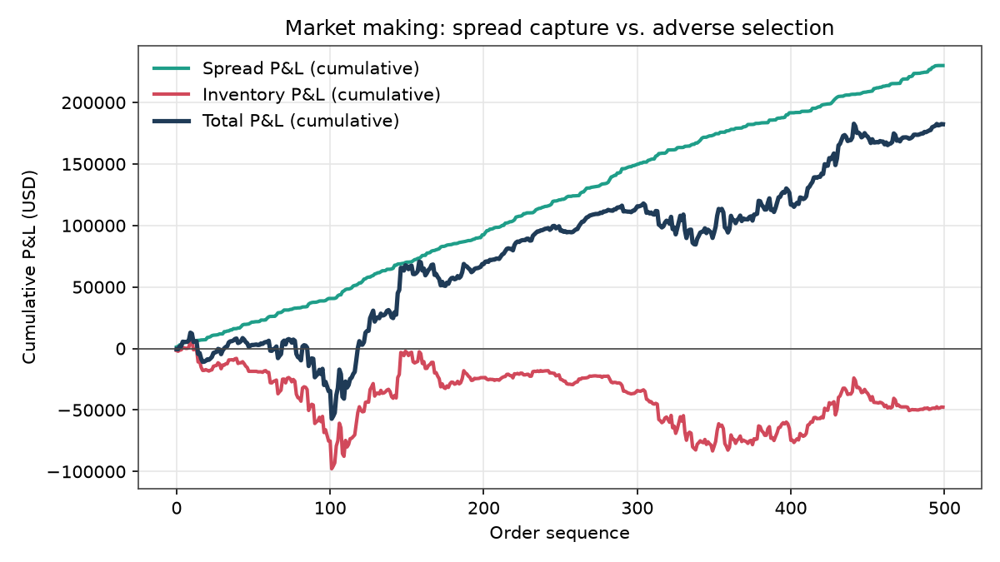
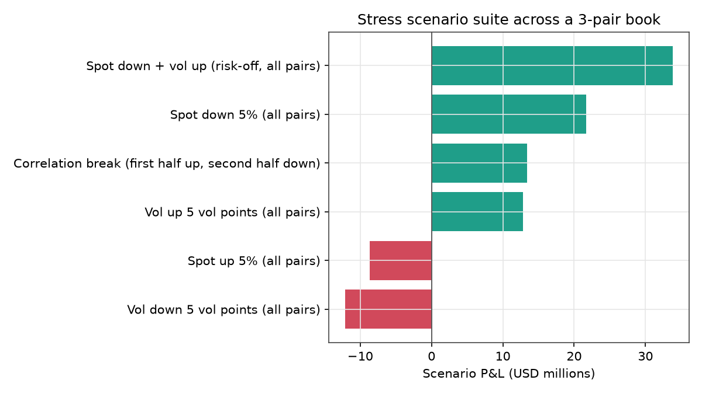
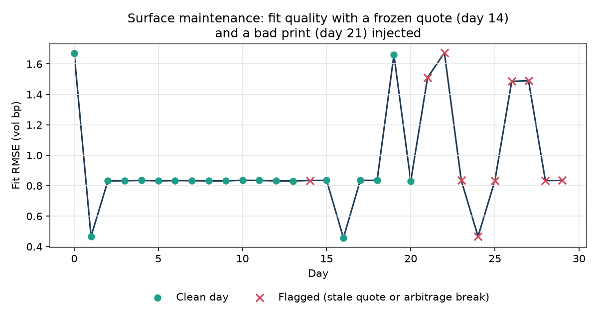
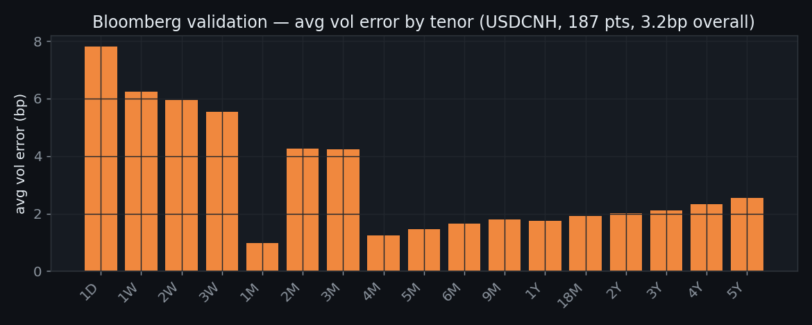
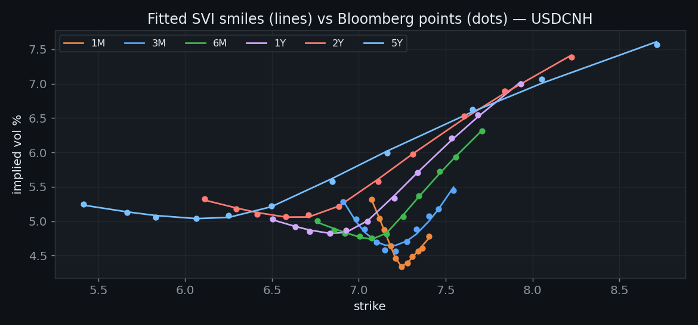
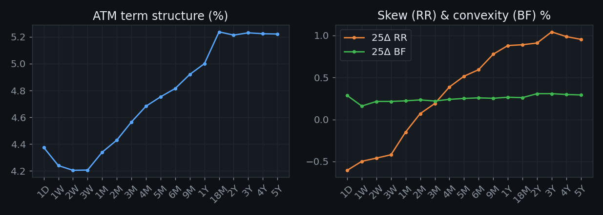
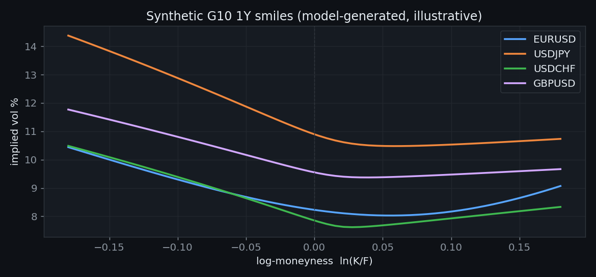
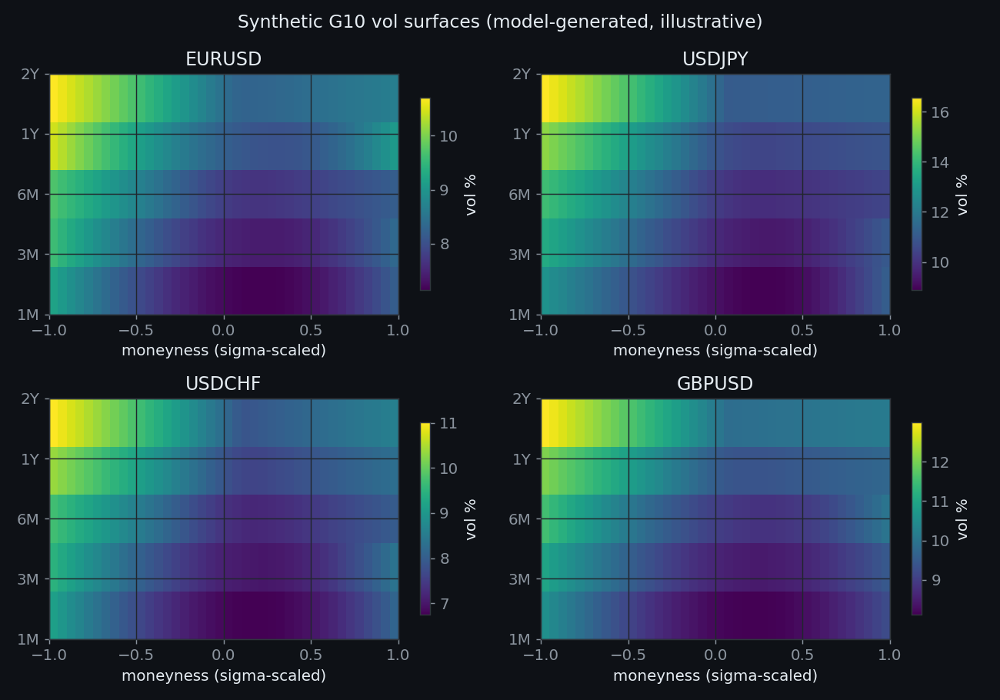
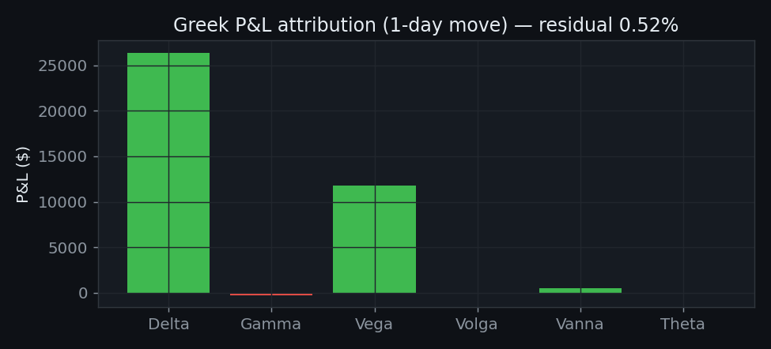
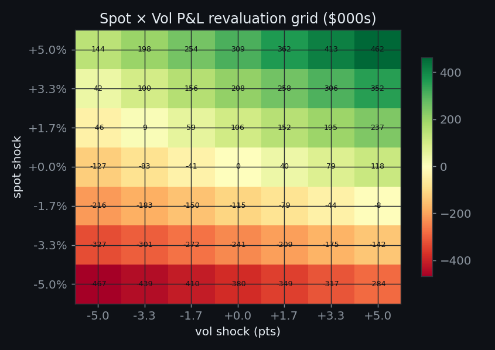

# fxvol — FX Volatility Modelling and Market Making

A Python library implementing FX options modelling as well trading desk extensions.

- Built an FX volatility surface and exotics pricing library (Garman-Kohlhagen, Heston/LSV to a three-factor stochastic model); reproduced Bloomberg's USDCNH vol surface to **3.2bp average error across 187 points**.
- Extended it into a desk toolkit: inventory-skewed market-making simulator, cross-currency risk dashboard, and daily surface-maintenance pipeline with automated arbitrage checks.
- 52 tests, full type checking, and a layered pricing/desk/data architecture.

## Trading desk
This is an extension of simulated trading desk use.
The layers below build a working vol surface with appropriate models. This part simulates answers for the 3 questions:

- market making: how does the desk quote against that surface
- risk dashboad: how is risk tracked once positions are traded across several pairs
- vol surface maintenance: how does the surface stay right it was built.

### Market making: quoting under inventory risk

`desk/marketmaking/` turns the surface into a two way price that reacts to what the
desk already holds. **Spread and skew are modeled as two separate knobs**: spread
compensates for taking on any risk at all and widens with size; skew moves
both sides of the market in the direction that discourages adding to a
position the desk already carries, and is what makes the desk self correct
rather than just repricing the same risk. A client's fill probability falls
away from fair value, so skewing does not just change the price of a trade, it
changes whether the trade happens at all.



Same order flow, two engines: a desk skewing at the package default settings
ends a 500 order run carrying roughly a tenth of the net position that a
spread only, no skew engine ends up with, while capturing a comparable amount
of spread. The chart above shows the skewed engine's running total, split into
what was locked in at execution (spread) versus what the surviving inventory
did afterward (adverse selection).
### Cross pair risk dashboard

`desk/risk/dashboard.py` aggregates Greeks by pair and by tenor across a
multi currency book, flags when one pair or one bucket is carrying an
outsized share of total vega, and runs a named stress scenario suite,
including a correlation break scenario a single pair or single parallel shock
view cannot show.



<!-- A three pair book built to look EURUSD heavy by notional turns out, once
converted to vega, to be dominated by USDJPY instead. USDJPY's much higher
spot level means the same style of position carries far more vega per unit of
notional. That gap between "looks concentrated in notional" and "is
concentrated in vega" is exactly the failure mode the concentration check
exists to catch. -->

### Vol surface maintenance pipeline

`pricing/surface/maintenance.py` treats calibrating today's surface as one step in a daily loop: screen the incoming quotes for a frozen feed or a statistical
outlier, calibrate, run the existing butterfly and calendar arbitrage checks,
and score how well the fit reproduces the input quotes, in vol basis points,
so a slow drift is visible even on days nothing looks alarming on its own.



A 30 day run with a frozen 1M quote injected on day 14 and a bad 6M print
injected on day 21: the detector catches both on the day they happen, and the
fit RMSE chart shows something a single day's check would miss. The bad
print leaves the surface in a calendar arbitrage violation for most of the days that follow, until the quote is corrected. That persistence is the argument for tracking health over time rather than checking it once per day in isolation.


## Surface Modelling and Bloomberg validation

Each tenor's SVI smile is calibrated to all 11 Bloomberg strike/vol points under
Bloomberg's own conventions (delta-neutral straddle ATM, premium-adjusted,
spot delta <1Y / forward delta >=1Y) using Bloomberg's actual forwards. The
surface is then evaluated at Bloomberg's strikes and the implied vol compared.
USDCNH on 05 Mar 2025.



| Metric | Within 10D | Total (187 pts) |
|---|---|---|
| Vol abs error (avg) | 3.19 bp | 3.16 bp |
| Vol abs error (max) | 15.8 bp | 15.8 bp |
| Strike abs error (avg) | 0.00051 | 0.00062 |

Largest diffs sit at 1-day (no 1D forward on the rate screen; noisiest smile).
From 1W out, agreement is under 11 bp including the wings.

### Fitted smiles vs Bloomberg



Dots are Bloomberg's calibrated points; lines are the SVI fit. The smile steepens
and widens with tenor — the SVI parametrization tracks it across the full strike
range.



USDCNH ATM rises 4.4% -> 5.2%; the 25D risk reversal flips from negative (puts
bid) at the front to strongly positive at the back — a real feature of the pair.

Running real USDCNH rates exposed a genuine surface-interpolation
bug: total variance was read at a single surface-wide forward while each smile
was fitted in its own per-tenor forward. With USDCNH's forward running
7.26 -> 6.54 across the curve, long-tenor vols came out **roughly doubled**
(5Y ATM: 10.5% vs 5.2%). Flat-rate unit tests couldn't see it; the Bloomberg
comparison did. The fix stores per-tenor forwards and is guarded by a regression
test. The same bug would have mispriced the P&L engine and risk grid under any
realistic rate curve.Running real USDCNH rates exposed a genuine surface-interpolation

bug: total variance was read at a single surface-wide forward while each smile
was fitted in its own per-tenor forward. With USDCNH's forward running
7.26 -> 6.54 across the curve, long-tenor vols came out **roughly doubled**
(5Y ATM: 10.5% vs 5.2%). Flat-rate unit tests couldn't see it; the Bloomberg
comparison did. The fix stores per-tenor forwards and is guarded by a regression
test. The same bug would have mispriced the P&L engine and risk grid under any
realistic rate curve.

## Synthetic G10 surfaces

Because the Bloomberg data is licensed and not redistributed (see note below),
the repo ships **model-generated, illustrative** surfaces for the major pairs so
it runs end-to-end for anyone who clones it. These are built from realistic
ATM / RR / BF term structures — not market quotes — calibrated to resemble each
pair's characteristic smile (USDJPY's steep downside skew, EURUSD's mild low-vol
smile, etc.).





All four surfaces are arbitrage-free (butterfly and calendar checks pass). Build
one with `fxvol.synthetic.g10.build_surface("EURUSD")`.


## The modelling ladder

The package is organized in three groups: `pricing/` is the modelling ladder
below, `desk/` is what a trading desk builds on top of it (holding a book,
aggregating risk, quoting, hedging), and `data/` is what feeds both
(synthetic quotes for demos and tests, the Bloomberg validation harness).
Nothing in `pricing/` imports from `desk/` or `data/`; the dependency runs
one way, the same way a real pricing library sits underneath desk tooling
rather than the other way around.

| Layer | Module | Role |
|---|---|---|
| Foundation | `pricing/core/` | Garman-Kohlhagen, full Greeks, FX delta conventions |
| Surface | `pricing/surface/` | SVI smile + 2D surface, butterfly & calendar no-arb |
| Local vol | `pricing/localvol/` | Dupire local volatility from the surface |
| Stochastic vol | `pricing/stochvol/` | Heston via characteristic function + calibration |
| LSV | `pricing/lsv/` | Leverage function bridging Heston to exact fit |
| Multi-factor | `pricing/multifactor/` | FX spot + dual Hull-White rates, Monte Carlo |
| Exotics | `pricing/exotics/` | Barrier Monte Carlo, TARF pricing, built on the LSV and Heston layers |
| Surface maintenance | `pricing/surface/maintenance.py` | Daily recalibration, stale/outlier quote screening, arbitrage checks, fit-quality tracking |
| P&L | `desk/pnl/` | Book of positions, Greek P&L explain, shared market-shocking & valuation helpers |
| Risk | `desk/risk/` | Single-pair risk grid & limits, plus cross-pair aggregation, concentration flags, stress scenarios |
| Hedging | `desk/hedging/` | Delta-hedging strategy backtest |
| Market making | `desk/marketmaking/` | Two-way quoting under inventory skew, order flow, spread vs. adverse-selection P&L |
| Synthetic data | `data/synthetic/` | Illustrative G10 quote sets used across the demos and tests |
| Validation | `data/validation/` | The Bloomberg OVML comparison harness |

Each layer exists because the one below it fails at something a trader pays for:
Black-Scholes can't see the smile; the surface maps it but says nothing about
dynamics; local vol reprices vanillas exactly but gets the smile's *motion*
wrong (mishedging barriers); Heston fixes dynamics but loses exact fit; LSV
unifies both; and the three-factor model un-freezes interest rates for
long-dated exotics, where FX-rates correlation becomes priced, hedgeable risk.


## Greek P&L explain engine

The nightly desk process: decompose one day's book P&L into
delta / gamma / vega / volga / vanna / theta + an unexplained residual. A
small residual means the risk numbers faithfully describe the book. (Demo book
of four EURUSD options over a +0.4% spot, +0.5pt vol move.)



Delta and vega dominate; gamma, vanna and volga are small but non-zero — and
omitting the cross-terms is exactly what blows the residual open on a skewed
book. Here the residual is **0.5% of actual P&L**.


## Risk grid & limit monitor

Full spot x vol revaluation — not just point Greeks — surfaces where P&L craters
in the tails. Bucketed vega exposes term-structure bets a single vega number
hides; the limit monitor flags breaches per Greek, per bucket, and on worst-case
grid loss.



The demo book is long gamma/vega: it loses most when spot *and* vol fall together
(bottom-left), gains when both rise.


## Install & run

```bash
uv sync --extra dev
uv run pytest                                     # 52 tests

uv run python scripts/run_bloomberg_real.py       # the validation
uv run python scripts/demo_desk_workflow.py       # P&L + risk on a sample book
uv run python scripts/demo_market_making.py       # quoting under inventory skew
uv run python scripts/demo_risk_dashboard.py      # cross-pair risk & stress scenarios
uv run python scripts/demo_surface_maintenance.py # daily recalibration pipeline
uv run python scripts/generate_readme_figures.py  # rebuild the figures above
uv run python scripts/generate_extension_figures.py  # rebuild the three figures in this section
```


## Notes

- **Data:** the Bloomberg validation uses a real USDCNH OVML snapshot
  (05 Mar 2025) which is **licensed terminal data and not redistributed**. The G10 surfaces shipped in the repo are model-generated and illustrative.
- **Validation methodology** follows [Mathema](#references)'s Bloomberg OVML comparison.
- The P&L and risk sections use a representative synthetic EURUSD book, since
  position data isn't part of a market snapshot.
- Architecture: every model implements a common `calibrate`/`price` interface
  (`pricing/base.py`). Only a starting interface for now, not yet
  implemented by every model class below it; treat it as a documented
  contract rather than a claim that it is wired in everywhere today.
- Tooling: `pytest`, `ruff`, `mypy`, type hints throughout, CI on 3.10-3.12. `matplotlib` is a dev-only dependency, used solely to regenerate the README figures.

## References

https://help.mathema.com.cn/latest/docs/toolbox/bbg_ovml.html